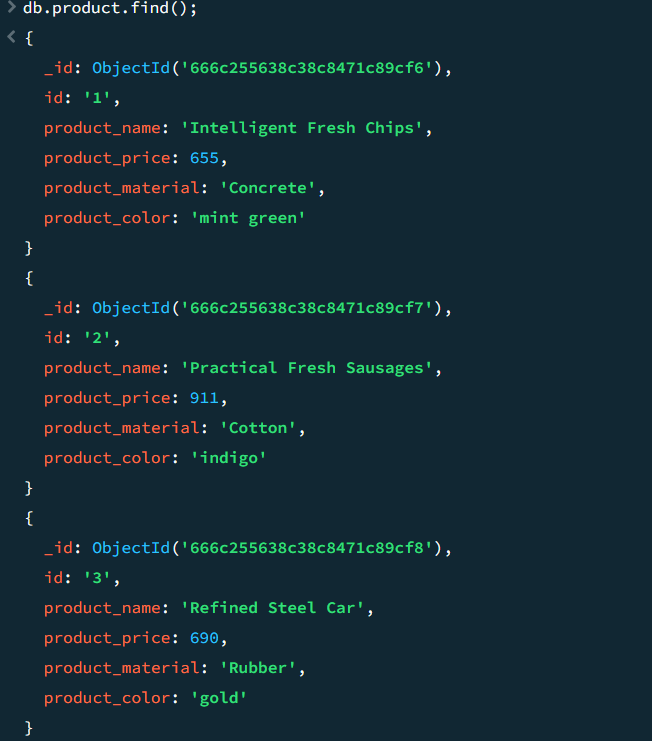
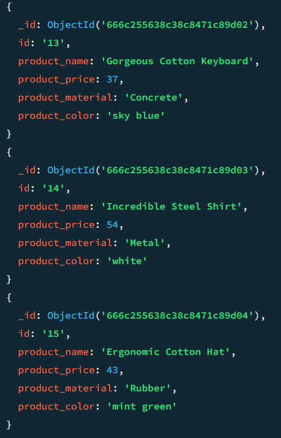

## MongoDB Day 1

**Product JSON:**
   - file (https://github.com/rvsp/database/blob/master/mongodb/product.json)

#### Loading data into MongoDB Compass 

### Step 1: Open MongoDB Compass

1. **Launch MongoDB Compass**: Open the MongoDB Compass application on your computer.

### Step 2: Create a New Database

3. **Create a New Database**:
   - Once connected, you will see a dashboard. Look for a button or link that says `Create Database`.
   - Click on `Create Database`.

4. **Enter Database Details**:
   - **Database Name**: Enter a name for your new database.
   - **Collection Name**: Enter a name for your new collection (a collection is like a table in a relational database).

5. **Create Database and Collection**: Click on the `Create Database` button to create the database and the initial collection.

### Step 3: Load Data into the Collection

6. **Select the Database**:
   - After creating the database, you will see it listed in the sidebar. Click on the database name to open it.

7. **Select the Collection**:
   - Click on the collection name to open it. If you have just created it, it will be empty.

8. **Import Data**:
   - Inside the collection view, you will see an `Import Data` button. Click on it.
   - **Select File**: Choose the file you want to import (JSON, CSV, or other supported formats).
   - **Choose Import Options**: Depending on the file format, MongoDB Compass will provide you with various import options (e.g., JSON, CSV settings).
   - **Start Import**: Click on the `Import` button to begin the import process.

*For the following question write the corresponding MongoDB queries*

1. **Find all the information about each products.**

**Query:**
      
         db.product.find();

**Output:**
   
         

2. **Find the product price which are between 400 to 800.**

**Query:**
      
         db.product.find({product_price:{$gte: 400, $lte: 500}});

**Output:**
   
   

3. **Find the product price which are not between 400 to 600.**

**Query:**
      
      db.product.find({product_price: {$not: {$gte: 400, $lte: 500}}})
       
**Output:**

           
    
4. **List the four product which are greater than 500 in price.**

**Query:**
      
       db.product.find({product_price:{$gt: 500}}).limit(4);

**Output:**
   
  

5. **Find the product name and product material of each products.**

**Query:**
      
       db.product.find({},{product_name:1, product_material:1})

**Output:**
  
    

6. **Find the product with a row id of 10.**

**Query:**
      
       db.product.find({id:"10"},{})

**Output:**
  
  

7. **Find only the product name and product material.**

**Query:**
      
       db.product.find({},{product_name:1, product_material:1,_id:0})

**Output:**
  
    

8. **Find all products which contain the value of soft in product material.**

**Query:**
      
       db.product.find({ product_material: 'Soft'})

**Output:**
  
 
   

9. **Find products which contain product color indigo  and product price 492.00.**

**Query:**
       
       db.product.find({product_color: 'indigo' ,product_price: 492})
       (or)
       db.product.find({product_color: 'indigo' ,product_price: 492.00})
       

**Output:**

10. **Delete the products which product price value are 28.**

**Query:**
     
        db.product.remove({product_price: 28});

**Output:**

